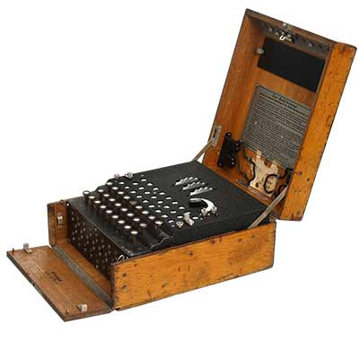

## 0450 - Implementando los mecanismos de cifrado de "Enigma"

__Importante__: 

  - Recuerda tomar nota del tiempo total en minutos (o en horas y minutos) que dedicas a realizar la actividad.
  - El código entregado debe compilar junto con la clase de test para que se corrija el ejercicio.
  - El código debe estar comentado de forma que javadoc sea capaz de generar la documentación de la aplicación.
  - Crea tu repositorio remoto en GitHub siguiendo este link: https://classroom.github.com/a/xty_5fFm

### Enunciado

"Enigma" era el nombre de una máquina real que disponía de varios mecanismo de cifrado, que permitía usarla tanto para cifrar como para descifrar números. Fue utilizada en Europa desde inicios de los años 1920, especialmente durante la II Guerra Mundial.

Dado un número permitía obtener otro número asociado al primero, que se denominaba número cifrado. Este proceso se conoce como encriptar. Lo que hacía importante a esta máquina es que a partir del número encriptado y, usando el mismo mecanismo de cifrado, era capaz de obtener el número original.

Para nuestro ejercicio solo vamos a considerar 3 mecanismos de encriptacion/desencriptacion:

* __Mecanismo de multiplicación por número primo__: se escoge un número primo que es el que se utiliza para encriptar el número original realizando una multiplicación. Para desencriptar se sigue el proceso inverso.

* __Mecanismo offset__: se elige un número `a` de 1 a 9. Se obvia el primer dígito del número original y, para el resto de dígitos, se incrementa en `a` cada dígito; si el resultado es mayor o igual que 10, se considera solo el último dígito del resultado. Para descencriptar se sigue el proceso inverso, obviando el primer dígito.

* __Mecanismo sumatorio parcial__: se elige un número `a` de 1 a 9. El número original `x` se suma al número `x-1` y el resultado al `x-2`, etc. hasta `a` incluido. El resultado es el número cifrado.

Enigma solo encripta/desencripta números mayores de 10; en caso de que el número a cifrar sea menor que 10, Enigma devuelve -1. Si el descifrado tampoco produce un número mayor que 10, entonces la función de descifrado devuelve -1 también.

Se pide que codifiques un programa en Java que simule la máquina Enigma y que sea capaz de pasar los siguientes tests:

* [Clase de test](Test0450.java)

Implementa los mecanismos en el orden arriba indicado y realiza 3 commits, uno por cada mecanismo implementado correctamente.

### Entrega

Cuando hayas terminado la actividad haz un push de la rama master al repositorio remoto de Github.

Haz un comentario público indicando:

  - El tiempo en horas y minutos que has tardado en completar la actividad.
  - El grado de dificultad que has apreciado.
  - Aquello que más te ha costado de la actividad.
  - El hash de 7 caracteres del último commit.
  
Entrega:

  - La URL de la pantalla del listado de commits de Github.
  - Una captura de pantalla de la pantalla anterior donde se muestren los commits realizados.
  - La URL de un video de Youtube donde se muestre cómo la aplicación pasa todos los tests.
  - Un comentario privado con el mismo contenido que el comentario público anterior.

