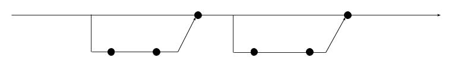

## 0534 - Practicando los arrays, los forks y las ramas

__Importante__: 

  - Recuerda tomar nota del tiempo total en minutos (o en horas y minutos) que dedicas a realizar la actividad.
  - El código debe estar comentado de forma que javadoc sea capaz de generar la documentación de la aplicación.
  
### Enunciado

Haz un fork en tu cuenta del siguiente repositorio:

* [weblog-analyzer-2016](https://github.com/miguelbayon/weblog-analyzer-2016-v2)

Clona el repositorio que se ha creado en tu cuenta de Github a tu equipo local y modifica el código para conseguir implementar las siguientes ramas de forma que, al finalizar tu trabajo, en la pestaña "Network" de Github se muestre un diagrama semejante al siguiente:





#### Rama 0543.a

##### Commit 01

Modifica el código de las clases del repositorio forkeado para que la funcionalidad de tu programa sea exactamente la misma pero ahora el constructor de la clase `Acceso` debe admitir un único parámetro de tipo String (en vez de 5 parámetros enteros). Este parámetro contendrá valores del tipo `"2016 11 30 22 13"`. Los métodos getter deben funcionar correctamente una vez realizados los cambios.

Se requiere que este commit pase los test de la clase `TestRama0543aCommit01`.

##### Commit 02

Implementa el código necesario para que tu programa sea ahora capaz de seguir funcionando de la misma forma que antes pero siendo capaz ahora de leer archivos de log más complejos como los incluidos de ejemplo en el repositorio que has forkeado (y dejando de leer los antiguos). Estos archivos contienen una línea por cada acceso al servidor que especifica la dirección IP del cliente que hace la petición, la fecha y hora de la misma, la página web que solicita y el código de respuesta HTTP con el que responde el servidor. Este cambio implica que tu programa deja de ser capaz de leer los archivos de log con los que trabajamos antes.

Además, se pide que ahora el constructor de la clase `Acceso` debe seguir admitiendo solo un único parámetro de tipo String. Este parámetro contendrá valores del tipo:

```
"91.244.73.61 [2016 01 01 10 56] instituto/normativa.html 403"
```

Se requiere que este commit pase los test de la clase `TestRama0543aCommit02`.


#### Rama 0543.b

##### Commit 01

Implementa un método llamado `paginaWebMasSolicitada` que no recibe parámetros y que únicamente devuelve un objeto de tipo String conteniendo el nombre de la página web más solicitada por los clientes. En caso de que se invoque este método sin haberse invocado el método `analizarArchivoDeLog` el método informa por pantalla de que no tiene datos, devuelve `null` y no hace nada más. En caso de empate es válido devolver cualquiera de las páginas.

Se requiere que este commit pase los test de la clase `TestRama0543bCommit01`.


##### Commit 02

Implementa un método llamado `clienteConMasAccesosExitosos` que no recibe parámetros y que únicamente devuelve un objeto de tipo String conteniendo la dirección del cliente que ha realizado mayor número de accesos exitosos al servidor. En caso de que se invoque este método sin haberse invocado el método `analizarArchivoDeLog` el método informa por pantalla de que no tiene datos, devuelve `null` y no hace nada más. En caso de empate se muestra el cliente con la IP más alta.

Se requiere que este commit pase los test de la clase `TestRama0543bCommit02`.


### Entrega

Cuando hayas terminado la actividad haz un push de la rama master a Github de tu repositorio. __Solo está permitido entregar ramas finalizadas__, es decir, no vale entregar commits intermedios, solo el commit en la rama master del merge de la última rama que hayas sido capaz de terminar.

Haz un comentario público indicando:

  - El tiempo en horas y minutos que has tardado en completar la actividad.
  - El grado de dificultad que has apreciado.
  - Aquello que más te ha costado de la actividad.
  - El hash de 7 caracteres del commit del merge de la última rama que hayas sido capaz a terminar.

Entrega:

  - La URL de la pantalla del listado de commits de Github.
  - La URL de la pantalla de Github del último commit.
  - La URL de un video de Youtube donde se muestre cómo la aplicación pasa los tests.
  - Un comentario privado con el mismo contenido que el comentario público anterior.

