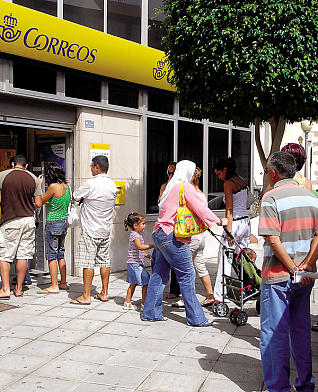

## 5555 - Correos

__Importante__: 

  - Recuerda tomar nota del tiempo total en minutos (o en horas y minutos) que dedicas a realizar la actividad.
  - El código entregado debe compilar junto con la clase de test para que se corrija el ejercicio.
  - El código debe estar comentado de forma que javadoc sea capaz de generar la documentación de la aplicación.
  - Crea tu repositorio remoto en GitHub siguiendo este link: https://classroom.github.com/a/xty_5fFm

### Enunciado

Vamos a simular el funcionamiento de una oficina de correos. En ella se va formando una cola de personas conforme van llegado a la oficina que esperan en orden a ser atendidas.

Ten en cuenta que tu programa debe cumplir obligatoriamente las siguientes condiciones:

* No puede utilizar ningún tipo de colección de las existentes en Java.
* Tu programa debe ser capaz de pasar los siguientes tests:

  * [Clase de test](Test5555.java)

### Entrega

Cuando hayas terminado la actividad haz un push de la rama master al repositorio remoto de Github.

Haz un comentario público indicando:

  - El tiempo en horas y minutos que has tardado en completar la actividad.
  - El grado de dificultad que has apreciado.
  - Aquello que más te ha costado de la actividad.
  - El hash de 7 caracteres del último commit.
  
Entrega:

  - La URL de la pantalla del listado de commits de Github.
  - Una captura de pantalla de la pantalla anterior donde se muestren los commits realizados.
  - La URL de un video de Youtube donde se muestre cómo la aplicación pasa todos los tests.
  - Un comentario privado con el mismo contenido que el comentario público anterior.

