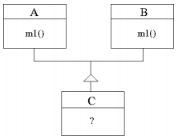
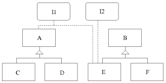

## El problema de la herencia mútliple en Java

Al contrario que en otros lenguajes, en Java no existe la herencia múltiple. En la siguiente figura se presenta un diseño (no permitido en Java) en el que la clase C hereda tanto de A como de B. Si, como ocurre en el ejemplo, las dos superclases A y B contienen el método `m1()` y dicho método está implementado de forma distinta en cada una de ellas, existiría un conflicto respecto a cuál de las dos implementaciones de `m1()` debería heredar C. 

Este conflicto, por otro lado, no se daría si `m1()` se hubiese definido abstracto tanto en A como en B, ya que en este caso el método no estaría implementado y por tanto no cabría esperar conflicto alguno. Podría pensarse, por tanto, que si A y B fuesen clases abstractas no debería haber inconveniente en permitir la herencia múltiple. Sin embargo, las clases abstractas pueden contener métodos no abstractos, con lo que la exigencia propuesta de que las superclases sean abstractas no garantizaría la ausencia de conflictos en un esquema de herencia múltiple.

Para que un diseño como el propuesto fuera fácilmente implementable debería existir algún mecanismo que exigiera tanto a A como a B que todos sus métodos fuesen abstractos. Además, por motivos similares, dicho mecanismo no debería permitir la declaración de atributos de instancia en A o en B, ya que podría darse el caso de que existieran dos atributos con el mismo nombre.

Pues bien, este mecanismo existe en Java y se lleva a la práctica mediante lo que se conoce como __interfaz__. El uso de interfaces, más allá de tratar de resolver únicamente el problema de la herencia múltiple, guarda una estrecha relación con el concepto de polimorfismo, tal y como se verá más adelante.

## Interfaces en Java

La interfaz de una clase viene definida de forma implícita en función de los miembros públicos que contenga dicha clase. Además de esta definición implícita, Java dispone de un mecanismo para definir explícitamente la interfaz (o parte de la interfaz) de una clase, lo que permite separarla completamente de su implementación. Ello se hace mediante la declaración de lo que en Java se denomina una interfaz. 

Sintácticamente, las interfaces son como las clases pero sin variables de instancia y con métodos declarados sin cuerpo. La definición de una interfaz tiene la forma siguiente:

    modificadorDeAcceso interface nombre_interfaz {
        tipo var1;
        tipo var2;
    
        tipo metodo1();
        tipo metodo2();
    }

El `modificadorDeAcceso` de una interfaz debe ser público, bien con la palabra reservada `public` o sin modificador de acceso (`friendly`). Después se especifica que la siguiente definición pertenece a una interfaz utilizando la palabra reservada `interface`, seguida del nombre de la interfaz y del bloque de código correspondiente a la definición de la interfaz. 

Las variables declaradas en la interfaz, si las hay, son por defecto estáticas (`static`) y finales (`final`), lo que significa que han de ser inicializadas con un valor constante y su valor no puede cambiarse posteriormente. Los métodos no tienen cuerpo puesto que son básicamente métodos abstractos que han de ser implementados por las clases que implementan la interfaz.

Las interfeces tienen ciertas similitudes con las clases abstractas. De hecho, una interfaz podría verse como una clase abstracta sin atributos de instancia y en la que todos sus métodos son abstractos.

## Definición de una interfaz en Java

Como ejemplo se podría definir la interfaz de cierta colección de objetos del siguiente modo:

    public interface Coleccion {
        void anadirElemento(Object o);
        int getNumElementos();
        void mostrar();
    }

Se puede observar que la interfaz no hace suposiciones acerca de los detalles de implementación. Básicamente una interfaz define qué operaciones se pueden realizar, pero no cómo se realizan.

Una vez definida una interfaz, cualquier número de clases puede implementarla. Implementar una interfaz implica __implementar cada uno de los métodos__ definidos en la misma. Para indicar que una clase implementa una interfaz determinada, se utiliza la palabra reservada `implements` con la siguiente sintaxis:

    modificadorDeAcceso class nombreClase implements NombreInterfaz1 {
        ...
    }

Básicamente, todo lo que necesita una clase para implementar una interfaz es sobreescribir el conjunto completo de métodos declarados en dicha interfaz. En caso de que la clase no sobreescriba todos los métodos, dicha clase deberá declararse abstracta, ya que contiene métodos sin implementar.  Los métodos definidos en una interfaz deben ser declarados con `public` en la clase que los implementa.

Por ejemplo, podríamos realizar la siguiente implementación de la interfaz `Coleccion` utilizando un array para almacenar los distintos elementos del conjunto:

    public class MiColeccion1 implements Coleccion {
    
        private Object[] v;
        private int numElementos;
    
        public MiColeccion1(int maxElementos) {
            v = new Object[maxElementos];
            numElementos = 0;
        }
    
        // Implementar los metodos de la interfaz Coleccion
        public void anadirElemento(Object o) {       
            if (numElementos < v.length) {
                v[numElementos] = o;
                numElementos++;
            }
        }

        public int getNumElementos() {
            return numElementos;
        }

        public void mostrar() {
            for (int i = 0; i < numElementos; i++) {
                System.out.println(o);  
            }                           
        }
    }

Podría realizarse, por otro lado, una implementación alternativa basada en un `ArrayList`:

    public class MiColeccion2 implements Coleccion {
    
        private ArrayList<Object> arrayList;
    
        public MiColeccion2() {
            arrayList = new ArrayList<>();
        }
        
        // Implementar los metodos de la interfaz Coleccion
        public void anadirElemento(Object o) {
            arrayList.add(o);
        }
        public int getNumElementos() {
            return arrayList.size();
        }
    
        public void mostrar() {
            for (Object o : arrayList)
                System.out.println(o);
        }
    }

Con este esquema, independientemente de que utilicemos objetos de tipo `MiColeccion1` o de tipo `MiColeccion2`, sabremos que en cualquier caso tendrán implementados los métodos `anadirElemento()`, `getNumElementos()` y `mostrar()` ya que todos ellos fueron definidos en la interfaz `Coleccion`.

## Ventajas que aportan las interfaces

Podría dar la sensación de que definir la interfaz en un lugar separado e independiente de la clase que lo implementa no aporte ninguna ventaja, ya que se puede "averiguar" fácilmente la interfaz de cualquier clase con tan solo fijarnos en sus métodos públicos, sin necesidad de definirla explícitamente en un lugar independiente de la clase. Por otro lado, este esquema tiene muchas similitudes con el concepto de clase abstracta, lo que nuevamente la utilidad de las interfaces parece diluirse. De hecho, implementar una interfaz tiene implicaciones muy similares a las que tendría extender una clase abstracta.

Existe, sin embargo, una diferencia fundamental: las clases abstractas se reutilizan e implementan mediante el esquema de herencia. Ello quiere decir que sólo se puede heredar de una clase abstracta. Sin embargo, una clase puede implementar múltiples interfaces, e incluso heredar a la vez de alguna otra clase.

Las interfaces están en una jerarquía distinta de la jerarquía de clases, por lo que es posible que varias clases que no tengan la más mínima relación de herencia implementen la misma interfaz. En la siguiente figura se muestran dos interfaces (I1 e I2) que son implementadas por clases que no en todos los casos tienen una relación de herencia. Concretamente, la clase A (y por extensión C y D) implementan la interfaz I1. Por otro lado, la clase E, que no guarda relación de herencia con las anteriores, también implementa I1. Adicionalmente, E implementa I2 (una clase puede implementar más de una interfaz).

## Consideraciones a tener en cuenta

Hay algunas consideraciones importantes acerca de las interfaces:

* Una interfaz únicamente puede contener atributos estáticos constantes y cabeceras de métodos.

* No es posible crear objetos de una interfaz.

* Una misma interfaz puede ser implementada por más de una clase.

* Una misma clase puede implementar más de una interfaz.

* Cualquier método definido en una interfaz se sobreentiende que es público, aunque no se ponga explícitamente las palabras `public abstract` delante del mismo.

* Cualquier atributo definido en una interfaz se sobreentiende que es público, estático y final, aunque no se pongan explícitamente las palabras `public static final` delante del mismo.

* Cualquier clase que implemente una interfaz deberá implementar todos los métodos definidos en la misma. Si no lo hace se convierte en una clase abstracta (por no tener todos sus métodos implementados) y deberá declararse como tal mediante la palabra reservada `abstract`.

## Interfaces y polimorfismo

Una interfaz es un tipo de dato y, por tanto, puede utilizarse para declarar variables o como tipo de dato en los parámetros de un método. Igual que una variable de una superclase puede referenciar a objetos pertenecientes a alguna de sus subclases (principio de sustitución), una variable de una interfaz puede emplearse para referenciar objetos pertenecientes a cualquier clase que implemente dicha interfaz. 

Ello permite implementar el __polimorfismo__ en tiempo de ejecución de un modo similar a como se implementa haciendo uso de clases abstractas.

Por ejemplo, dada la interfaz `Coleccion` del ejemplo anterior y sus dos implementaciones `MiColeccion1` y `MiColeccion2`, es posible declarar variables de tipo `Coleccion` y referenciar en ellas objetos de tipo `MiColeccion1` y `MiColeccion2`.

    Coleccion c;
    if(System.currentTimeMillis() % 2 == 0)
        c = new MiColeccion1();
    else
        c = new MiColeccion2();    
    
    for(int i = 0; i < 10; i++)
        c.anadirElemento(new Integer(i));
    
    System.out.print("La coleccion contiene los siguientes ");
    System.out.println(c.getNumElementos() + "elementos");
    c.mostrar();
    
    
En este ejemplo, según el momento temporal en el que se ejecuta el código, se crea un objeto de tipo `MiColeccion1` o de tipo `MiColeccion2`. Lo interesante del código anterior es que nuestro programa puede trabajar perfectamente con la variable `c` sin necesidad de conocer qué tipo de objeto se ha creado realmente bajo dicha referencia. 

Será, en tiempo de ejecución, cuando, al invocar cualquiera de los métodos de `c`, se decida qué método debe ejecutarse (en nuestro caso un método de la clase `MiColeccion2` o de la clase `MiColeccion2`). Este mecanismo, que permite posponer hasta el último momento la decisión del método que debe ejecutarse, se conoce como ligadura dinámica de método o enlace dinámico, es el mismo que se usa en la herencia común, y, a la postre, permite implementar el polimorfismo en tiempo de ejecución. 

A continuación se muestra un ejemplo completo en el que se ha definido la interfaz `ConjuntoOrdenable` y una clase `Ordena` con una serie de métodos que permiten ordenar cualquier conjunto ordenable. Lógicamente, para que un conjunto sea considerado ordenable debe implementar la interfaz `ConjuntoOrdenable`. Nuevamente, lo interesante del ejemplo que se muestra a continuación radica en que los métodos de la clase `Ordena` no necesitan conocer el tipo real de los objetos que se están ordenando.

        interface ConjuntoOrdenable {
            public int getNumElementos();
            public boolean menor(int i, int j);
            public void intercambiar(int i, int j);
            
        }
        
        public class Ordena {
            // Este metodo puede ordenar cualquier conjunto
            // que implemente la interfaz ConjuntoOrdenable
            public static void seleccionDirecta(ConjuntoOrdenable c) {
                int pos_min, N = c.getNumElementos();
                for (int i = 0; i <= N - 2; i++) {
                    pos_min = i;
                    for (int j = i + 1; j < N; j++) {
                        if (c.menor(j, pos_min)) {
                            pos_min = j;
                        }
                    }
                    c.intercambiar(i, pos_min);
                }
            }
        
            public static void burbuja(ConjuntoOrdenable c) {
                    // Otro metodos de ordenacion
            }
        
            public static void quickSort(ConjuntoOrdenable c) {
                    // Otro metodo de ordenacion
            }
        }
        
        
        // Una implementacion concreta de un ConjuntoOrdenable
        class ConjuntoPalabras implements ConjuntoOrdenable {
        
            private LinkedList lista;
            // Metodos propios
            ConjuntoPalabras() {
                lista = new LinkedList();
            }
        
            public void inserta(String s) {
                lista.add(s);
            }
        
            public String toString() {
                String s = "";
                for (int i = 0; i < lista.size(); i++) {
                    s = s + lista.get(i) + " ";
                }
                return s;
            }
            // Metodos exigidos por la interfaz ConjuntoOrdenable
            public int getNumElementos() {
                return lista.size();
            }
        
            public boolean menor(int i, int j) {
                String s1 = (String) lista.get(i);
                String s2 = (String) lista.get(j);
                if (s1.compareTo(s2) < 0) {
                    return true;
                } else {
                    return false;
                }
            }
        
            public void intercambiar(int i, int j) {
                Object pal1 = lista.get(i);
                Object pal2 = lista.get(j);
                lista.set(j, pal1);
                lista.set(i, pal2);
            }
        }
        
        public class EjemploInterfazOrdena {
        
            public static void main(String[] args) {
                ConjuntoPalabras cp = new ConjuntoPalabras();
                cp.inserta("las");
                cp.inserta("interfaces");
                cp.inserta("son");
                cp.inserta("muy");
                cp.inserta("utiles");
                System.out.println(cp);
                Ordena.seleccionDirecta(cp);
                System.out.println(cp);        
            }
        }

Sobre el ejemplo anterior conviene resaltar que:

* `seleccionDirecta` es un método estático. Por eso se puede invocar sin necesidad de crear objetos de tipo `Ordena` (se invoca anteponiendo al método el nombre de la clase).

* El método `seleccionDirecta` admite cualquier objeto de `tipo ConjuntoOrdenable`.

* Los objetos de tipo `ConjuntoPalabras` también son de tipo `ConjuntoOrdenable`, ya que implementa dicha interfaz.

* El método `seleccionDirecta` espera recibir como parámetro algún objeto de tipo `ConjuntoOrdenable` sin embargo, cuando se invoca se le está pasando un objeto de tipo `ConjuntoPalabras`. Esto es posible gracias al principio de sustitución y a que los objetos de tipo `ConjuntoPalabras`, de algún modo, también son de tipo `ConjuntoOrdenable`.

Podríamos ampliar el ejemplo anterior para ilustrar cómo una clase puede implementar más de una interfaz al mismo tiempo:

        interface ConjuntoDesordenable {
            public int getNumElementos();
            public void intercambiar(int i, int j);
        }
        
        public class Desordena {
            // Este metodo puede desordenar cualquier conjunto que ´
            // implemente la interfaz ConjuntoDesordenable
            public static void desordenar(ConjuntoDesordenable c) {
                Random rnd = new Random();
                int n = c.getNumElementos();
                for (int i = 0; i < n * 2; i++) {
        
                    // Selecciono dos elementos aleatorios y los
                    // cambio de lugar
                    int elem1 = Math.abs(rnd.nextInt()) % n;
                    int elem2 = Math.abs(rnd.nextInt()) % n;
                    c.intercambiar(elem1, elem2);
                }
            }
        }
        
        class ConjuntoPalabras implements ConjuntoOrdenable, ConjuntoDesordenable {
                ...
                ...
        }
        
        
Ahora, los objetos de tipo `ConjuntoPalabras` no sólo pueden ordenarse sino también desordenarse. Esto es así porque `ConjuntoPalabras` implementa tanto la interfaz `ConjuntoOrdenable` como `ConjuntoDesordenable` y, por tanto, cualquier método que requiera como parámetro objetos de alguno de estos tipos, podrá recibir sin problemas objetos de tipo `ConjuntoPalabras`.

Por otro lado, el cuerpo de la clase `ConjuntoPalabras` será igual al del ejemplo anterior ya que, aunque ahora implementa también la interfaz `ConjuntoDesordenable`, todos los métodos requeridos por esta interfaz ya existían en la versión anterior y, por tanto, ya están implementados. De no ser así, hubiese sido necesario implementar los nuevos métodos requeridos por la interfaz `ConjuntoDesordenable`.

Las interfaces pueden extender otras interfaces. Además, a diferencia de lo que ocurre con las clases, entre interfaces se permite la herencia múltiple.
        
